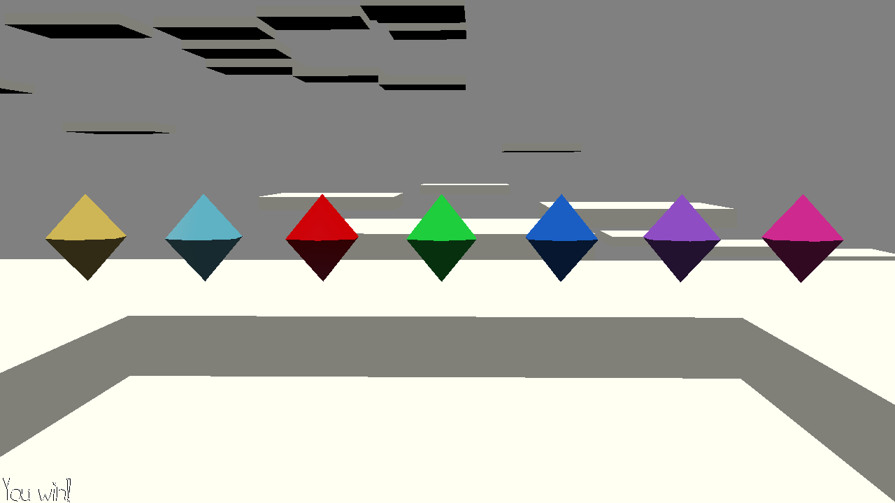

# Noisy Collectibles

Author: Tyler Thompson

Design:
This game is a platforming collector game in which the player must collect the collectibles in a specific order. This order is shown as a song at the start of the game and as musical notes throughout the game.

Screen Shot:

How To Play:

Controls:
Look with the mouse.
Move with the WASD keys.
Jump with the space bar.

Strategy:
Listen to the song and collectible notes at the beginning. This is the order you must collect the collectibles in. Once the game has started, listen for the collectible notes to help you remember the correct order.

Sources:
All code sources are called out in in-line comments.
Deserving special code callout is Dominic Calkosz who wrote the Makefile for Windows I used to build Blender scenes for the game.
Additionally, the Wikipedia page https://en.wikipedia.org/wiki/Conversion_between_quaternions_and_Euler_angles is worthy of special recognition for providing the code to switch between quaternions and Euler angles.
The (now unused, but still in the files) background music is Bar Brawl, which was written by Bryan Tech and was made available for free and in the public domain on freepd.com.
All other sounds were made by me using trinket.io/music.
The model for the collectibles is the Jewel model from the Platformer Kit made available for free and with fair use on https://kenney.nl/.
All other models were made by me in Blender.

This game was built with [NEST](NEST.md).

